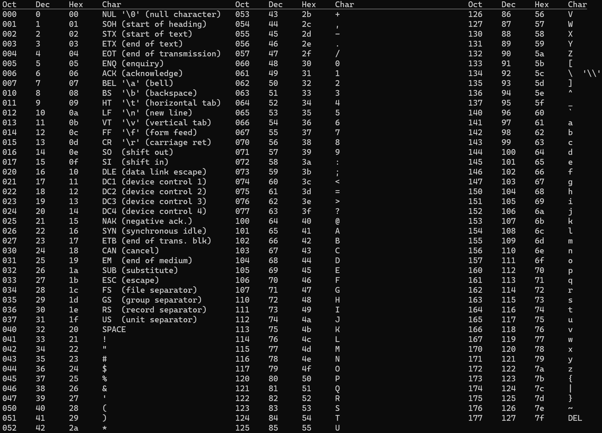

<div align="center">
    <h1>ascii-table</h1>
    </a>
</div>
 


---
```
Command-line utility for displaying ASCII table

USAGE:
    ascii-table [FLAGS] [OPTIONS]

FLAGS:
    -h, --help        Prints help information
    -n, --no-style    Without ANSI tags
    -V, --version     Prints version information

OPTIONS:
    -l, --limit <COLUMS>    Upper limit for colums
```